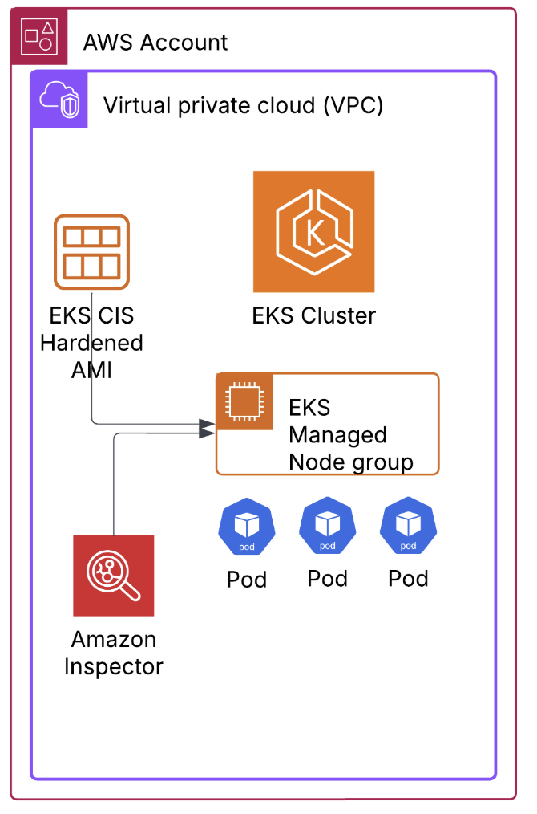
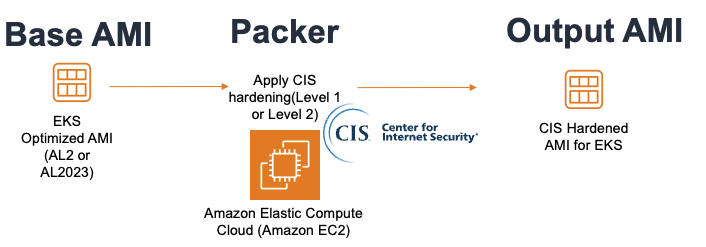
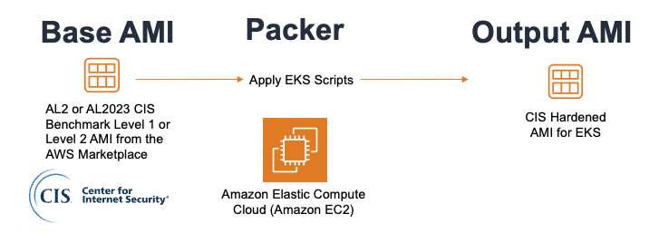
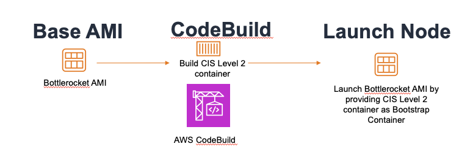

# Security Hardened AMIs for EKS

This project provides a fully automated solution to create security-hardened Amazon EKS AMIs that comply with either CIS Level 1 or Level 2 standards.

There are three types of guidance generally being requested from AWS Customers:

1. Customers seeking guidance on how to generate a CIS-hardened AMI for EKS.
2. Customers encountering issues with workloads running on their custom, CIS-hardened AMIs.
3. Customers requesting the EKS team to prioritize the release of an official CIS-hardened EKS AMI.

**This solution address the topics 1 and 2 above.**

## 💪 Motivation

Currently, information is spread across different resources and there isn't a central location that explain how to apply CIS scripts for each of the available AMIs. In other words, there is no existent holistic mechanism that can measure the impact of changes in any of the different sources - CIS Scripts, CIS AMIs and EKS Optimized AMIs.

Please find the link below for existing resources with detailed steps on how to achieve either Level 1 or Level 2 compliance according to each base AMI:

| Base AMI | Level 1 | Level 2 |
| --- | --- | --- |
| EKS Optimized AL2 | [EKS Security Workshop](https://catalog.workshops.aws/eks-security-immersionday/en-US/10-regulatory-compliance/cis-al2-eks) and [https://aws.amazon.com/blogs/security/how-to-create-a-pipeline-for-hardening-amazon-eks-nodes-and-automate-updates/](https://aws.amazon.com/blogs/security/how-to-create-a-pipeline-for-hardening-amazon-eks-nodes-and-automate-updates/) | [EKS Security Workshop](https://catalog.workshops.aws/eks-security-immersionday/en-US/10-regulatory-compliance/cis-al2-eks) and [https://aws.amazon.com/blogs/security/how-to-create-a-pipeline-for-hardening-amazon-eks-nodes-and-automate-updates/](https://aws.amazon.com/blogs/security/how-to-create-a-pipeline-for-hardening-amazon-eks-nodes-and-automate-updates/) |
| EKS Optimized AL 2023 | [https://aws.amazon.com/blogs/security/how-to-create-a-pipeline-for-hardening-amazon-eks-nodes-and-automate-updates/](https://aws.amazon.com/blogs/security/how-to-create-a-pipeline-for-hardening-amazon-eks-nodes-and-automate-updates/) | [https://aws.amazon.com/blogs/security/how-to-create-a-pipeline-for-hardening-amazon-eks-nodes-and-automate-updates/](https://aws.amazon.com/blogs/security/how-to-create-a-pipeline-for-hardening-amazon-eks-nodes-and-automate-updates/) |
| Bottlerocket AMI | Out of the box compliant | [ https://aws.amazon.com/blogs/containers/validating-amazon-eks-optimized-bottlerocket-ami-against-the-cis-benchmark/]( https://aws.amazon.com/blogs/containers/validating-amazon-eks-optimized-bottlerocket-ami-against-the-cis-benchmark/) and [EKS Security Workshop](https://catalog.workshops.aws/eks-security-immersionday/en-US/10-regulatory-compliance/2-cis-bottlerocket-eks) |
| CIS Amazon Linux 2 Benchmark | N/A | [https://aws.amazon.com/blogs/containers/building-amazon-linux-2-cis-benchmark-amis-for-amazon-eks/](https://aws.amazon.com/blogs/containers/building-amazon-linux-2-cis-benchmark-amis-for-amazon-eks/) |
| CIS Amazon Linux 2 Kernel 4.14 Benchmark | [https://aws.amazon.com/blogs/containers/building-amazon-linux-2-cis-benchmark-amis-for-amazon-eks/](https://aws.amazon.com/blogs/containers/building-amazon-linux-2-cis-benchmark-amis-for-amazon-eks/) | N/A |
| CIS EKS-Optimized Amazon Linux 2 Level 1 Image | Out of the box compliant | No existent resource available so far |
| CIS EKS-Optimized Amazon Linux 2 Level 2 Image | N/A | Out of the box compliant |
| CIS Amazon Linux 2023 Benchmark - Level 1 | No existent resource available so far | No existent resource available so far |
| CIS Amazon Linux 2023 Benchmark - Level 2 | No existent resource available so far | [https://aws.amazon.com/blogs/containers/automating-al2023-custom-hardened-ami-updates-for-amazon-eks-managed-nodes/](https://aws.amazon.com/blogs/containers/automating-al2023-custom-hardened-ami-updates-for-amazon-eks-managed-nodes/) |

As we can see from the table above, guidance available are spread across different resources(Workshops/Blog Posts) using different tech and there is no single solution that cover a single process for all the base AMIs available.

## 🤯 Why is this problem space complex?
- There are more than 200 CIS Scripts/Checks
- There are Multiple AMI Variants(EKS + CIS L1 and L2) - AL2, AL2023, Bottlerocket OS
- A change from one side(EKS or CIS) can break the other side = no integrated tests exists
- There are different release cadence schedule from CIS Scripts, CIS AMIs and EKS AMIs
- It is hard to measure downstream impact on workloads

## 🕵 Overview of the solution

A fully automated solution that enables customers to create security-hardened EKS AMIs compliant with Center for Internet Security (CIS) benchmarks.
The solution will consider the following base AMIs(depending on the pattern you choose) and apply Level 1 and Level 2 CIS Benchmark Hardening where applicable.

- EKS_Optimized_AL2
- EKS_Optimized_AL2023
- BOTTLEROCKET
- CIS_Amazon_Linux_2_Kernel_4_Benchmark_Level_1
- CIS_Amazon_Linux_2_Benchmark_Level_2
- CIS_Amazon_Linux_2023_Benchmark_Level_1
- CIS_Amazon_Linux_2023_Benchmark_Level_2

Currently solution uses base AMIs with x86_64 architecture.

Solution Diagram

Detailed steps are inside each pattern folder, but the overall steps for each pattern are as follows:

**Step 1.** Users run `make run-static-tests` command for static code analysis tests

**Step 2.** Users run `make plan` and `make apply` to deploy VPC resource using Terraform.

**Step 3.** Users run `make create-hardened-ami` to create security-hardened Amazon EKS AMIs using Packer using one of the methods outlined below.

**Step 4.** Users run `make cluster-plan` and `make cluster-apply` to create EKS Cluster and create EKS managed node groups for each security-hardened Amazon EKS AMI as part of the same EKS Cluster. This also will deploy several different apps and add-ons and will run tests to see if the workload will run without issues.

**Step 5.** Users run `make run-cis-scan` to trigger AWS Inspector CIS scans to scan EKS manages nodes and generate reports about checks which Passed, are Skipped or Failed.

There are different approaches for hardening the Amazon EKS AMI for CIS Benchmark Level 1 or Level 2 profiles which this automation takes care of:

**Method 1.** Use the standard Amazon EKS Amazon Linux 2 Optimized AMI or Amazon Linux 2023 Optimized AMI as a base and add hardening on top of it. This process requires to apply all configuration mentioned in the Amazon Linux CIS Benchmark specification.

This process is part of following patterns:
- [EKS_Optimized_AL2](./patterns/EKS_Optimized_AL2/)
- [EKS_Optimized_AL2023](./patterns/EKS_Optimized_AL2023/)

**Method 2.** Use the Amazon Linux 2 (AL2) CIS Benchmark Level 1 or Level 2 AMI from the AWS Marketplace as a base, and add Amazon EKS specific components on top of it.

This process is part of following patterns:
- [CIS_AL2](./patterns/CIS_AL2/)
- [CIS_AL2023](./patterns/CIS_AL2023/)

**Method 3.** Use the Amazon EKS optimized Bottlerocket AMI (as of this writing) which supports 18 out of 28 Level 1 and 2 recommendations specified in the CIS Benchmark for Bottlerocket, without a need for any additional configuration effort. For the remaining 10 recommendations to adhere to Level 2, six recommendations can be addressed via a bootstrap container and four recommendations can be addressed via kernel sysctl configurations in the user data of the Amazon EKS worker nodes.

This process is part of following pattern:
- [BOTTLEROCKET](./patterns/BOTTLEROCKET/)

The benefits of this solution includes:

- Automation will allow scripts and tests run through with no effort after every new AMI release from AWS or from CIS.
- We are going to have a central place for compare impact of changes from EKS Optimized AMI or scripts provided by CIS in regards CIS Hardening compliance on EKS.
- Resources can be used for learning and guide our AWS Internal/External community to support customers through their hardening requirements.

## 👯 Dependencies

Terraform Modules:
- [terraform-aws-modules/vpc/aws](https://github.com/terraform-aws-modules/terraform-aws-vpc)
- [terraform-aws-modules/eks/aws](https://github.com/terraform-aws-modules/terraform-aws-eks)
- [terraform-aws-modules/eks/aws//modules/eks-managed-node-group](https://github.com/terraform-aws-modules/terraform-aws-eks/tree/master/modules/eks-managed-node-group)
- [aws-ia/eks-blueprints-addons/aws](https://github.com/aws-ia/terraform-aws-eks-blueprints-addons)

EKS Optimized AMI Packer Scripts
- [amazon-eks-ami](https://github.com/awslabs/amazon-eks-ami.git)

## ⑂ Forked to be part of the solution

- [cis-bottlerocket-benchmark-eks](https://github.com/aws-samples/containers-blog-maelstrom/tree/main/cis-bottlerocket-benchmark-eks)
- [amazon-eks-custom-amis](https://github.com/aws-samples/amazon-eks-custom-amis.git)

## 💻 Support & Feedback

This project is maintained by AWS engineers. It is not part of an AWS
service and support is provided as a best-effort by the EKS community. To provide feedback,
please use the [issues templates](issues)
provided. If you are interested in contributing to this project, see the
[Contribution guide](CONTRIBUTING.md).

## 🔒 Security

See [CONTRIBUTING](CONTRIBUTING.md#security-issue-notifications) for more information.

## 📄 License

Apache-2.0 Licensed. See [LICENSE](LICENSE).
