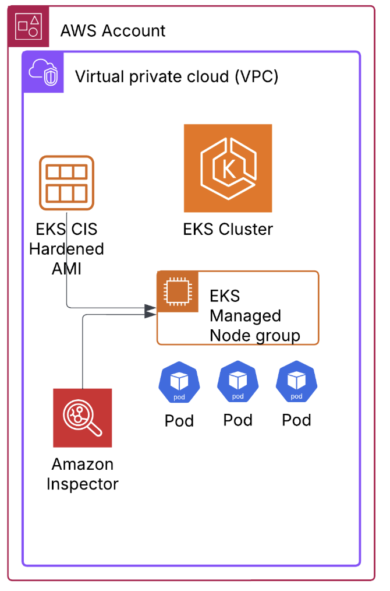
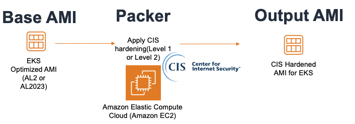
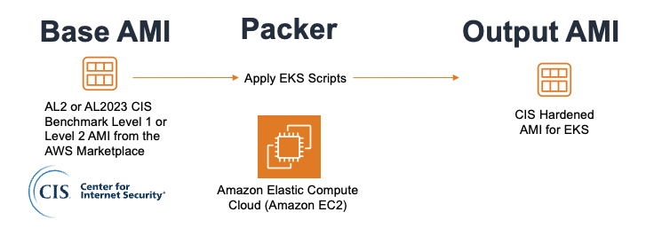
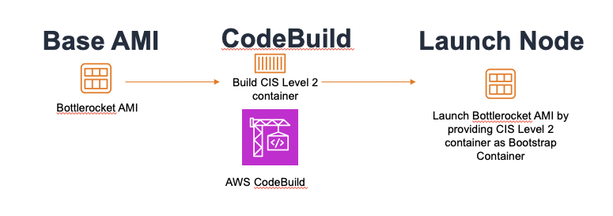

# Security Hardened AMIs for EKS

This project provides a fully automated solution to create security-hardened Amazon EKS AMIs that comply with either CIS Level 1 or Level 2 standards.

There are three types of guidance generally being requested from AWS customers:

1. Customers seeking guidance on how to generate a CIS-hardened AMI for EKS.
2. Customers encountering issues with workloads running on their custom, CIS-hardened AMIs.
3. Customers requesting the EKS team to prioritize the release of an official CIS-hardened EKS AMI.

**This solution addresses topics 1 and 2 above.**

## 💪 Motivation

Information is currently spread across different resources, and there isn't a central location that explains how to apply CIS scripts for each of the available AMIs. There is no holistic mechanism that can measure the impact of changes across the different sources — CIS Scripts, CIS AMIs, and EKS-Optimized AMIs.

As shown in the table in the Further Resources section, available guidance is spread across different resources (workshops and blog posts) using different stacks, and there is no single solution that covers a uniform process for all the available base AMIs.

## 🤯 Why is this problem space complex?
- There are more than 200 CIS scripts/checks
- There are multiple AMI variants (EKS + CIS L1 and L2) — AL2023, Bottlerocket
- A change on one side (EKS or CIS) can break the other; no integrated tests exist
- CIS scripts, CIS AMIs, and EKS AMIs follow different release cadences
- It is hard to measure downstream impact on workloads

## 🕵 Overview of the solution

A fully automated solution that enables customers to create security-hardened EKS AMIs compliant with Center for Internet Security (CIS) benchmarks.
The solution considers the following base AMIs (depending on the pattern you choose) and applies Level 1 and Level 2 CIS Benchmark hardening where applicable.

- EKS_Optimized_AL2023
- BOTTLEROCKET
- CIS_Amazon_Linux_2023_Benchmark_Level_1
- CIS_Amazon_Linux_2023_Benchmark_Level_2

The solution currently uses base AMIs with x86_64 architecture.

Solution Diagram

Detailed steps are provided within each pattern folder. For a guided experience, follow the prompts when running the file ``create-hardened-ami.sh``.

There are different approaches for hardening the Amazon EKS AMI for CIS Benchmark Level 1 or Level 2 profiles which this automation takes care of:

**Method 1.** Use the standard Amazon EKS Amazon Linux 2023 Optimized AMI as a base and add hardening on top of it. This process requires applying all configurations mentioned in the Amazon Linux CIS Benchmark specification.

This process is part of the following patterns:
- [EKS_Optimized_AL2023](./patterns/EKS_Optimized_AL2023/)

**Method 2.** Use the Amazon Linux 2023 CIS Benchmark Level 1 or Level 2 AMI from the AWS Marketplace as a base, and add Amazon EKS specific components on top of it.

This process is part of the following patterns:
- [CIS_AL2023](./patterns/CIS_AL2023/)

**Method 3.** Use the Amazon EKS-optimized Bottlerocket AMI, which already meets a majority of the CIS Benchmark for Bottlerocket recommendations without additional configuration. Remaining Level 2 recommendations are addressed via a bootstrap container and via kernel sysctl configurations supplied through the Amazon EKS worker nodes' user data.

This process is part of the following pattern:
- [BOTTLEROCKET](./patterns/BOTTLEROCKET/)

The benefits of this solution include:

- Automation runs scripts and tests with no manual effort after every new AMI release from AWS or CIS.
- A central place to evaluate the impact of changes from EKS-optimized AMIs or CIS scripts on EKS hardening compliance.
- A reference for AWS support, partners, and customers building hardened EKS AMIs to meet their hardening requirements.

## 🤝 Shared Responsibility

This project produces a hardened EKS node AMI. An AMI is one layer of a secure EKS deployment. The operator remains responsible for the build environment, the AWS account and infrastructure surrounding the AMI, the cluster and workloads that run on it, and the AMI lifecycle. CIS Benchmark hardening of the host OS satisfies a subset of controls in frameworks such as NIST 800-53 and PCI DSS — it does not by itself produce compliance with any of them.

For the full breakdown of which controls this repository provides and which remain with the operator across six layers (base AMI, hardening overlay, build environment, CI/CD pipeline, AWS account, and cluster/workload controls), see [docs/SHARED-RESPONSIBILITY.md](./docs/SHARED-RESPONSIBILITY.md).

## 👯 Dependencies

Terraform Modules:
- [terraform-aws-modules/vpc/aws](https://github.com/terraform-aws-modules/terraform-aws-vpc)
- [terraform-aws-modules/eks/aws](https://github.com/terraform-aws-modules/terraform-aws-eks)
- [terraform-aws-modules/eks/aws//modules/eks-managed-node-group](https://github.com/terraform-aws-modules/terraform-aws-eks/tree/master/modules/eks-managed-node-group)
- [aws-ia/eks-blueprints-addons/aws](https://github.com/aws-ia/terraform-aws-eks-blueprints-addons)

EKS Optimized AMI Packer Scripts
- [amazon-eks-ami](https://github.com/awslabs/amazon-eks-ami.git)

## ⑂ Forked to be part of the solution

- [cis-bottlerocket-benchmark-eks](https://github.com/aws-samples/containers-blog-maelstrom/tree/main/cis-bottlerocket-benchmark-eks)
- [amazon-eks-custom-amis](https://github.com/aws-samples/amazon-eks-custom-amis.git)

## 💻 Support & Feedback

This project is maintained by AWS engineers. It is not part of an AWS service, and support is provided as a best effort by the EKS community. To provide feedback, please open an issue in this repository's GitHub Issues tab. If you are interested in contributing, see the [Contribution guide](CONTRIBUTING.md).

## 🔒 Security

For the boundary between what this project secures and what the operator secures, see [docs/SHARED-RESPONSIBILITY.md](./docs/SHARED-RESPONSIBILITY.md). To report a vulnerability, see [CONTRIBUTING](CONTRIBUTING.md#security-issue-notifications).

## 📄 License

Apache-2.0 Licensed. See [LICENSE](LICENSE).

## 📚 Further Resources

Please see the link below for AWS resources that were used as references for this repository's solution. It includes detailed steps for achieving either Level 1 or Level 2 compliance based on each base AMI:

| Base AMI | Level 1 | Level 2 |
| --- | --- | --- |
| EKS Optimized AL2023 | [https://aws.amazon.com/blogs/security/how-to-create-a-pipeline-for-hardening-amazon-eks-nodes-and-automate-updates/](https://aws.amazon.com/blogs/security/how-to-create-a-pipeline-for-hardening-amazon-eks-nodes-and-automate-updates/) | [https://aws.amazon.com/blogs/security/how-to-create-a-pipeline-for-hardening-amazon-eks-nodes-and-automate-updates/](https://aws.amazon.com/blogs/security/how-to-create-a-pipeline-for-hardening-amazon-eks-nodes-and-automate-updates/) |
| Bottlerocket AMI | Out of the box compliant | [https://aws.amazon.com/blogs/containers/validating-amazon-eks-optimized-bottlerocket-ami-against-the-cis-benchmark/](https://aws.amazon.com/blogs/containers/validating-amazon-eks-optimized-bottlerocket-ami-against-the-cis-benchmark/) and [EKS Security Workshop](https://catalog.workshops.aws/eks-security-immersionday/en-US/10-regulatory-compliance/2-cis-bottlerocket-eks) |
| CIS Amazon Linux 2023 Benchmark - Level 1 | No existent resource available so far | No existent resource available so far |
| CIS Amazon Linux 2023 Benchmark - Level 2 | No existent resource available so far | [https://aws.amazon.com/blogs/containers/automating-al2023-custom-hardened-ami-updates-for-amazon-eks-managed-nodes/](https://aws.amazon.com/blogs/containers/automating-al2023-custom-hardened-ami-updates-for-amazon-eks-managed-nodes/) |

